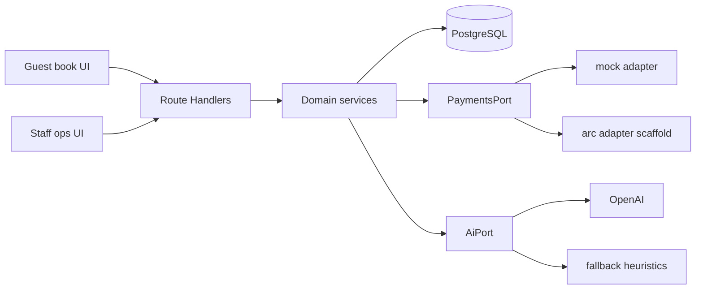

# Architecture — TableOS

## Context

TableOS v1 ships a **restaurant OS shell** with a **settlement-critical vertical slice**. Long-term schemas support full ops; v1 UI proves book → hold → attend → release.

## Module boundaries

| Area | Responsibility |
|---|---|
| `features/*` | Use-cases (book, create event, door release) |
| `domain/*` | Pure functions (splits, capacity, guest copy) |
| `lib/ports/*` | Outbound adapters (payments, AI) |
| `lib/auth` | Session + RBAC helpers |
| `components/ui` | Design-system primitives (tokens-driven) |
| `app/api/*` | HTTP edge; validation with Zod |

## Auth & RBAC

- **Demo path:** signed HTTP-only cookie (`DEMO_AUTH_ENABLED=true`)
- Roles: OWNER, GM, HOST, DOOR, FINANCE, VIEWER (subset used in UI)
- **Supabase:** env placeholders ready; login returns 501 when demo auth off — wire `@supabase/ssr` next

## Payments

`PaymentsPort` methods: `createEscrow`, `releaseOnCondition`, `refund`.

| Adapter | Behavior |
|---|---|
| `mock` | In-memory escrow refs; deterministic demo |
| `arc` | Returns `not_configured` / `adapter_error` until RPC+contracts implemented |

On-chain sketch: `contracts/src/TableOSEscrow.sol` (not called by app).

## AI

`AiPort`: `summarizeOperations`, `searchReservationsNaturalLanguage`, `complete`.  
Without `OPENAI_API_KEY`, fallback heuristics keep the product usable.

## Data

See [`DB.md`](./DB.md). Feature flags table supports gradual OS expansion.

## Deployment

See [`../deployment/DEPLOYMENT.md`](../deployment/DEPLOYMENT.md). Target: Vercel + managed Postgres (Supabase/Neon) + optional R2 later.
