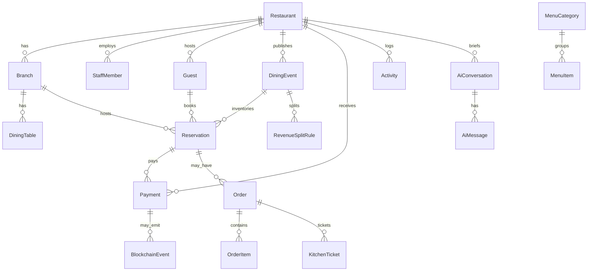

# Database

## ER (core vertical slice + OS stubs)

## Notes

- Money stored as **integer cents**
- Split rules in **basis points** (10000 = 100%)
- `BlockchainEvent` / `AgentEvent` are forward-compatible stubs
- Kitchen / menu / loyalty fields exist for OS vision; v1 UI does not operate them end-to-end

## Migrations

Dev: `npm run db:push`  
Prod: prefer `npm run db:migrate` once migration history is established
